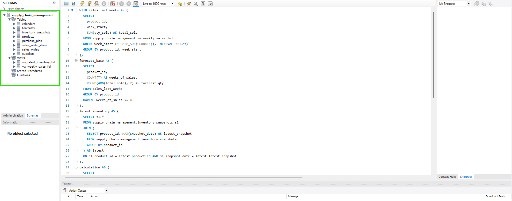
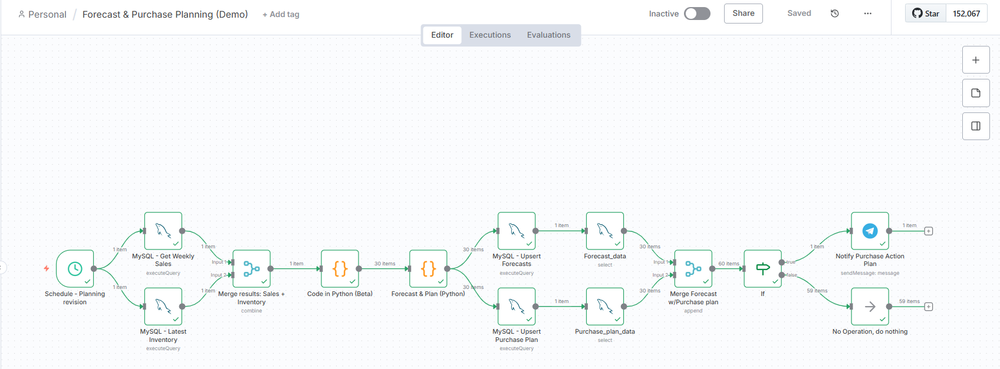
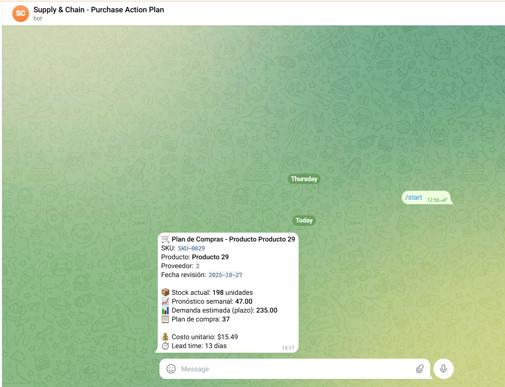

# Forecast & Purchase Planning Automation with n8n

## Description

Automated workflow that integrates **predictive analytics, inventory management, and intelligent notifications** to optimize purchase planning for businesses with rotating stock.

The system uses historical sales data and inventory levels to **predict future demand** and automatically generate **weekly purchase plans**, notifying the responsible person via **Telegram** about products that require replenishment.

In other words: **it anticipates stockouts before they happen**, helping reduce stockouts, excess inventory, and response times.

## Business Benefits

- **Prevents stockouts:** detects at-risk products and automatically calculates replenishment quantities
- **Optimizes working capital:** maintains healthy inventory, reducing idle products
- **Data-driven decisions:** integrates real sales, inventory, and supplier lead times for reliable projections
- **Saves operational time:** replaces manual spreadsheets and repetitive calculations with 100% automated flow
- **Smart alerts:** Telegram notifies only products that actually require action, filtering noise

## Measurable Impact

- **Stockout reduction:** up to 80% fewer shortages
- **Planning time savings:** +90% fewer manual tasks
- **Capital optimization:** balance between availability and turnover
- **Full traceability:** all information stored and available for subsequent analysis

## Tech Stack

| Technology | Purpose |
|-----------|---------|
| **n8n** | Workflow orchestration and no-code automation |
| **Python** | Forecast calculation and planning logic |
| **MySQL** | Structured storage of historical data, inventory, and results |
| **Telegram Bot API** | Real-time notification channel |

## Workflow Architecture

The complete n8n workflow follows this pipeline:

1. **Schedule – Planning Revision** — Triggers automatic execution (e.g., every Monday at 8:00 AM)
2. **MySQL – Get Weekly Sales** — Queries historical sales by product, aggregated weekly
3. **MySQL – Latest Inventory** — Gets the most recent inventory snapshot per product
4. **Merge** — Joins sales and inventory data per product
5. **Python – Data Preparation** — Cleans and combines data, ensuring valid history
6. **Python – Forecast & Plan** — Calculates demand forecast using moving averages considering:
   - Expected demand
   - Supplier lead time
   - Current stock
   - Planning horizon (weeks to cover)
7. **MySQL – Upsert Forecasts** — Inserts/updates weekly forecast results
8. **MySQL – Upsert Purchase Plan** — Records generated purchase plans
9. **Merge (Final)** — Combines forecast and purchase plan for reporting
10. **IF – Action Filter** — Sends to Telegram only products with `purchase_plan > 0`
11. **Telegram – Notify** — Sends detailed message with key data per product
12. **No Operation** — Alternative route for products requiring no action

## Screenshots

### Database Schema (Remote Server)

### Workflow in Execution

### Telegram Notification to Execute Purchase

## Author

**Facundo Gimenez** — [LinkedIn](https://www.linkedin.com/in/facundo-r-gimenez/) | [GitHub](https://github.com/facundogimenez-data)
