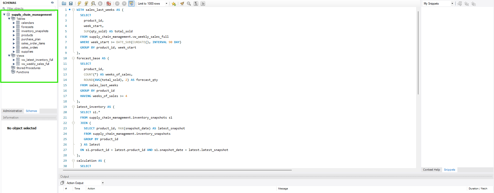
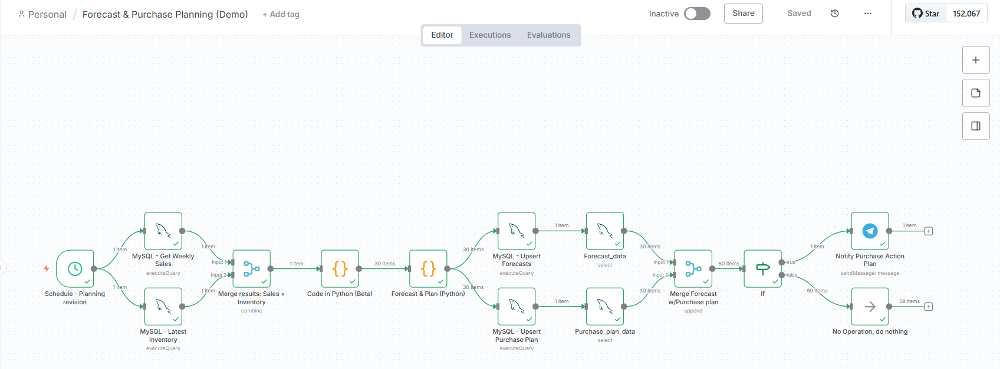
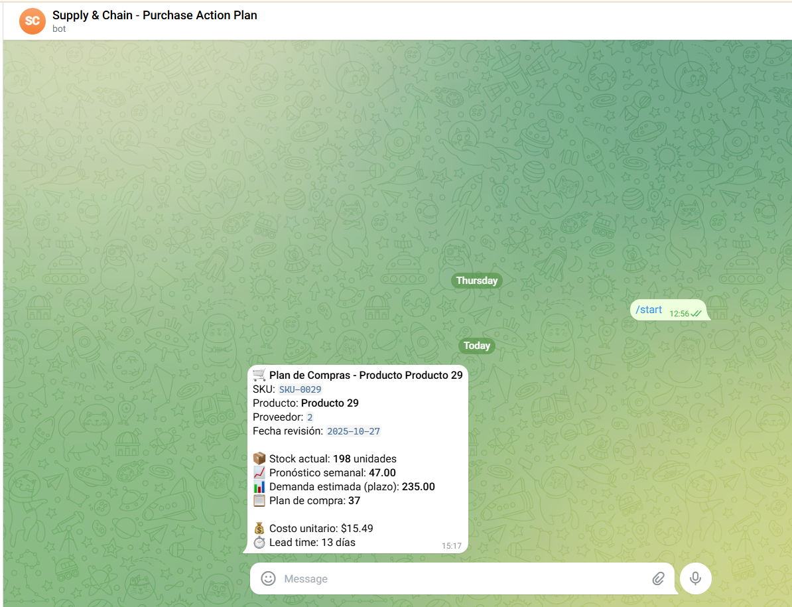

# Forecast & Purchase Planning Automation with n8n


## ⚠️ Production case study — confidentiality note

This automation **runs in production** for a real distribution business. The original
workflow connects to the company's MySQL database with live sales, inventory, and
supplier data, which **cannot be shared publicly for GDPR / client-confidentiality
reasons**.

What you'll find in this repo is a **faithful reconstruction** of the same
architecture and logic — rebuilt end-to-end on a demo n8n instance, with sample data
and the author's own Telegram/WhatsApp accounts as notification targets — so the
full pipeline can be inspected and run independently of the client's infrastructure.

## Description

Automated workflow that integrates **demand forecasting, purchase planning, an AI
agent, and multi-channel notifications** to optimize replenishment for a business
with rotating stock (weekly planning cycle).

Every week, the workflow reads recent sales and current inventory, calculates a
short-horizon demand forecast and a purchase plan per product (covering the planning
horizon plus the supplier's lead time), and uses an **AI Agent** to turn that data
into a clear, natural-language purchase recommendation — delivered automatically via
**Telegram and WhatsApp**, and visualized on a **live Streamlit dashboard**.

In short: **it replaces a weekly manual planning routine with an automated,
explainable, and observable pipeline.**

## Real-world impact (verified with the client)

- **+30 hours saved per month.** The team forecasted demand weekly and spent an
  average of **6–7 hours per week** doing it manually (cross-referencing sales,
  stock, and supplier lead times in spreadsheets). The automation now runs that
  full cycle unattended.
- **35–40% fewer stockouts.** Measured reduction in stock-related shortages after
  adoption — the rest of the variance is explained by other commercial factors
  (promotions, demand spikes, supplier delays) that sit outside the forecasting model.
- **Full traceability.** Every forecast and purchase plan is persisted in MySQL,
  giving the team a historical record to review and refine planning decisions over time.

## Tech Stack

| Technology | Purpose |
|-----------|---------|
| **n8n** | Workflow orchestration: scheduling, data pipeline, error handling, sub-workflows |
| **MySQL** | Storage for sales history, inventory snapshots, forecasts, and purchase plans |
| **OpenAI (GPT-4.1 mini) + AI Agent** | Turns raw forecast/plan numbers into natural-language purchase recommendations |
| **Telegram Bot API + Evolution API (WhatsApp)** | Multi-channel delivery of recommendations and error alerts |
| **Streamlit** | Live dashboard reading directly from the automation's output tables |
| **Docker** | Containerized dashboard, ready to deploy alongside the n8n instance |

## Workflow Architecture

The pipeline is split across **three workflows** (main flow, a reusable
calculation sub-workflow, and a dedicated error handler) — a modular structure
that keeps the core forecasting logic testable and reusable from other automations.

### 1. Main workflow — `Forecast & Purchase Planning`

1. **Schedule – Planning Revision** — Triggers weekly (e.g., every Monday at 8:00 AM)
2. **MySQL – Get Weekly Sales** / **MySQL – Latest Inventory** — Pull recent sales
   history (aggregated by week) and the latest stock snapshot per product
3. **Merge** — Joins both data streams per product
4. **Execute Forecast Calculation** — Calls the *Forecast Calculation Engine*
   sub-workflow (see below) for each product
5. **MySQL – Upsert Forecasts** / **MySQL – Upsert Purchase Plan** — Persist the
   results, ready for reporting and historical analysis
6. **IF – Action Filter** — Routes only products with `purchase_plan > 0` onward
7. **AI Agent – Purchase Recommendation** (OpenAI GPT-4.1 mini) — Receives the
   structured forecast/plan data per product (stock, forecast, lead time, unit cost...)
   and produces a clear, actionable purchase recommendation in natural language
8. **Notify Purchase Action Plan (Telegram)** + **Notify via WhatsApp (Evolution API)**
   — Deliver the AI-generated recommendation through both channels in parallel
9. **No Operation** — Alternative route for products that require no action this cycle

The workflow's `errorWorkflow` setting points to the dedicated error handler below,
so any failure anywhere in the pipeline is caught and reported automatically.

### 2. Sub-workflow — `Forecast Calculation Engine`

A reusable, callable sub-workflow that isolates the core calculation logic
(see [`src/forecast_plan.py`](src/forecast_plan.py) for a Python reconstruction):

1. **Prepare Sales + Inventory Data** — Consolidates merged records into one
   structured object per product (sales history + current stock + supplier data)
2. **Calculate Forecast & Purchase Plan** — Computes:
   - **Forecast:** short-horizon moving average of weekly sales
   - **Purchase plan:** quantity needed to cover the planning horizon *plus*
     the supplier's lead time, net of current stock — `max(0, planned_demand − on_hand)`

Extracting this logic into its own sub-workflow means it can be triggered,
tested, and reused independently of the scheduling/notification layer — and
swapped for a more advanced forecasting method later without touching the rest
of the pipeline.

### 3. Error handler — `Forecast & Purchase Planning - Error Handler`

A separate workflow triggered automatically by any failure in the main flow or
the sub-workflow:

1. **Error Trigger** — Catches the failed execution (workflow, node, error message)
2. **Build Error Message** — Formats a concise, readable alert
3. **Notify Error (Telegram)** — Sends it immediately to the responsible person,
   so failures are noticed in minutes, not discovered days later in a missing report

## Live Dashboard

A lightweight **Streamlit + MySQL** app ([`dashboard/`](dashboard/)) closes the loop
from *automation → data → visualization*: it reads directly from the `forecasts`,
`purchase_plan`, and `inventory_snapshots` tables and shows, for the current planning
cycle:

- Number of products analyzed and how many need replenishment
- Estimated purchase value for the week
- A per-product table with stock, forecast, suggested purchase quantity, and lead time
- A forecast-vs-current-stock chart

Run it locally:

```bash
cd dashboard
cp .env.example .env   # set your MySQL credentials
pip install -r requirements.txt
streamlit run app.py
```

Or with Docker:

```bash
cd dashboard
docker build -t forecast-dashboard .
docker run -p 8501:8501 --env-file .env forecast-dashboard
```

## Source files

| File | Purpose |
|------|---------|
| [`src/forecast_plan.py`](src/forecast_plan.py) | Python reconstruction of the forecast + purchase-plan logic that runs inside the n8n sub-workflow's Code (JavaScript) nodes |
| [`src/queries.sql`](src/queries.sql) | SQL queries used by the MySQL nodes (sales history, inventory snapshot, upserts, dashboard query) |
| [`dashboard/`](dashboard/) | Streamlit app + Dockerfile for the live planning dashboard |

## Screenshots

### Database Schema (Remote Server)


### Workflow in Execution


### Telegram Notification to Execute Purchase


## Author

**Facundo Gimenez** — [LinkedIn](https://www.linkedin.com/in/facundo-r-gimenez/) | [GitHub](https://github.com/facundogimenez-data)
